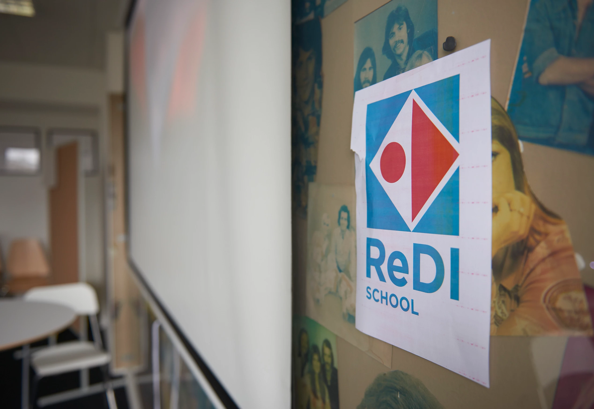

# Lesson 1: put a decent title

1. TOC
{:toc}


Material:
- [Wikipedia 1](https://en.wikipedia.org/wiki/Berlin)
- [Wikipedia 2](https://en.wikipedia.org/wiki/Germany)

## Part 1

This is an example list:

* item 1
* item 2
* item 3
* item 4
* item 5

Here is some sample code in Java:

```java
// Hello World in Java

class HelloWorld {
  static public void main( String args[] ) {
    System.out.println( "Hello World!" );
  }
}
```

Lorem ipsum dolor sit amet, consectetur adipiscing elit, sed do eiusmod tempor
incididunt ut labore et dolore magna aliqua. Ut enim ad minim veniam, quis nostrud
exercitation ullamco laboris nisi ut aliquip ex ea commodo consequat.

Duis aute irure dolor in reprehenderit in voluptate velit esse cillum dolore eu fugiat
nulla pariatur. Excepteur sint occaecat cupidatat non proident, sunt in culpa qui officia
deserunt mollit anim id est laborum.

## Part 2

This is how to add an image:



Lorem ipsum dolor sit amet, consectetur adipiscing elit, sed do eiusmod tempor
incididunt ut labore et dolore magna aliqua. Ut enim ad minim veniam, quis nostrud
exercitation ullamco laboris nisi ut aliquip ex ea commodo consequat.

## Part 3

Lorem ipsum dolor sit amet, consectetur adipiscing elit, sed do eiusmod tempor
incididunt ut labore et dolore magna aliqua. Ut enim ad minim veniam, quis nostrud
exercitation ullamco laboris nisi ut aliquip ex ea commodo consequat.
