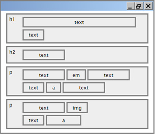

# CSS Layout

## Document Flow

Document flow refers to the way the browser positions elements on the page. The browser starts at the top left of the page and starts placing elements one after another.

Document flow is most affected by a property called display. There are two main display properties: block and inline.

### Display Block

**Block** elements expand to the **full width** of the available horizontal space. The next element will be placed underneath. A div is an example of a block level element. It expands to the full width of the available space.

### Display Inline

**Inline** level elements are **only as wide as their content**. Multiple inline elements stack up next to each other and can be nested inside block level elements. A span is an example of an inline level element.

Block level elements are used for large pieces of content such as headings or text areas. Inline level elements are used to style small areas, such as adding italics to a few words.

### Display Inline-Block

Compared to display: inline, the major difference is that display: inline-block allows to set a width and height on the element.

Also, with display: inline-block, the top and bottom margin and padding are respected, but with display: inline they are not.

Compared to display: block, the major difference is that display: inline-block does not add a line-break after the element, so the element can sit next to other elements.

### Block level elements

- header, footer, nav, section, main, div, table, form
- ul, ol, p
- h1, h2, h3, h4, h5, h6

### Inline level elements

- strong, em
- span, img, a
- button, input, label, select, textarea

### CSS property display

Using the CSS property display we can override the default display setting and change an element to be block or inline. This is useful because it's not possible to set the width or height of inline level elements. We can also hide an element by setting display: none;

### Layout Example

Learn more

- [W3Schools: CSS Display Property](https://www.w3schools.com/css/css_display_visibility.asp)
- [W3Schools: CSS Display Inline Block](https://www.w3schools.com/css/css_inline-block.asp)
