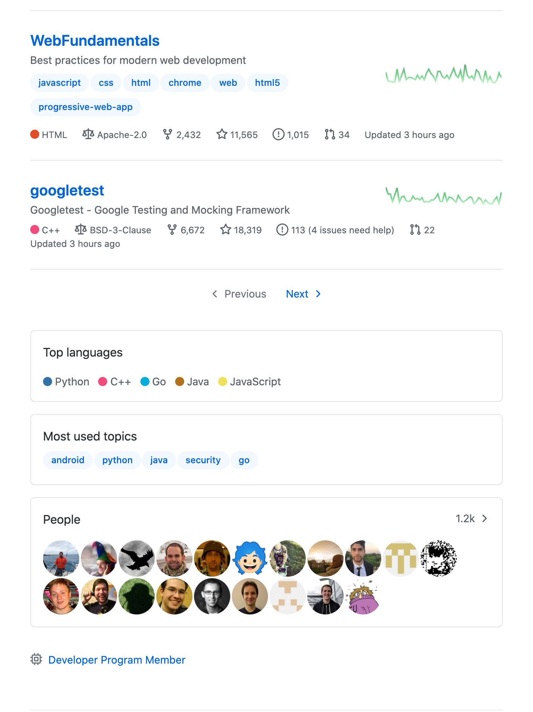

# Responsive Web Design

Responsive web design (RWD) is a web development approach that creates dynamic changes to the appearance of a website, 
depending on the screen size and orientation of the device being used to view it.

By following a RWD approach, we can adapt the same web documents to the multitude of devices available, ranging from 
tiny phones to huge desktop monitors. This is the easiest and more affordable way to target multiple devices.

On the technical side, we need to define the viewport on HTML and work with media queries and flexible media through CSS 
(yes, we'll get there soon) but most important is to know how the content and the structure of the page will adapt.

## Examples

### Slack


### Google


---

- What happened with the content blocks?
- What happened with the font sizes?
- What happened with the images?

## How does it work

- We give the device the content and the structure with HTML
- We tell how to display and style it with CSS
- We ask the device the screen size (and/or device type and/or orientation) and tell it what to change.

For example, we have a blog. On the main page we show the content (the last 10 posts) and the extras (a list of the most 
popular ones and a few widgets).

To make this page responsive, we need to ask the device: if you are a laptop or bigger, please (always important to be 
nice) display the content and the extras side by side. Take 2/3 for the content and 1/3 for the extras.

If you are a tablet or phone, display the extras below the content and use the full width of the screen for each.

In CSS, the first part could be:

```css
#main-page {
    display: flex;
}

#main-page #content {
    width: 66%;
}

#main-page #extras {
    width: 34%;
}
```


In the second case, it could be:

```css
#main-page {
    display: flex;
    flex-direction: column;
}

#main-page #content,
#main-page #extras {
    width: 100%;
}
```



## Setting the viewport

`<meta name="viewport" />` is a special meta tag, that gives to the browser instructions on how to control the page's 
dimensions and scaling. It takes few properties and should be included to your HTML like this:

```html
<!DOCTYPE html>
<html lang="en">
    <meta charset="utf-8" />
    <!-- Viewport meta tag -->
    <meta name="viewport" content="width=device-width, initial-scale=1.0" />
    <link rel="stylesheet" src="styles.css" />
    <body>
        <!-- Content of your website -->
    </body>
</html>
```

According to [MDN documentation](https://developer.mozilla.org/en-US/docs/Mozilla/Mobile/Viewport_meta_tag):

> The `width` property controls the size of the viewport. It can be set to a specific number of pixels like `width=600` 
or to the special value `device-width`, which is the width of the screen in CSS pixels at a scale of 100%. (There are 
corresponding `height` and `device-height` values, which may be useful for pages with elements that change size or 
position based on the viewport height.)

> The `initial-scale` property controls the zoom level when the page is first loaded. The `maximum-scale`, 
`minimum-scale`, and `user-scalable` properties control how users are allowed to zoom the page in or out.

## Learn more

- [Smashing Magazine: Responsive Web Design — What It Is And How To Use It](https://www.smashingmagazine.com/2011/01/guidelines-for-responsive-web-design/)
- [Alistapart: Responsive Web Design](https://alistapart.com/article/responsive-web-design)
- [Mediaqueri.es: esign examples](https://mediaqueri.es/)
