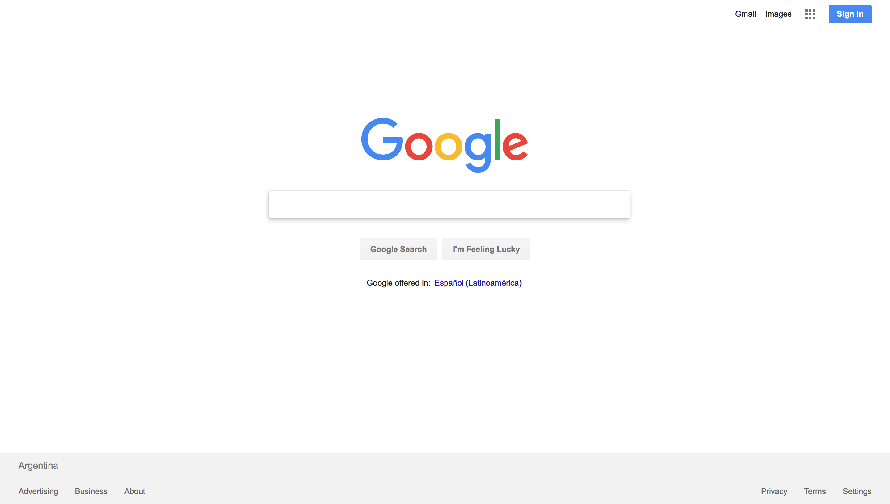

# Website Analysis

All websites are different because they serve different purposes. However, they share common structural elements,
both on their visual aspect and their code.

Most websites have their logos on the top left corner or the top center. The navigation is either on a top bar or on a
left column (or right-to-left languages is similar but on the other side). This is called consistency and you can see
it everywhere: a VW Golf and a Porsche are cars made for different purposes but they have a steering wheel on the left
side, three pedals and a shift stick (OK, they can have two pedals if they're automatic but they don't have 5 pedals and
a joystick).

Here we can review different websites, the audience they serve and the common structure elements they share. We will see
later that most of these elements are variations of a few HTML tags.

