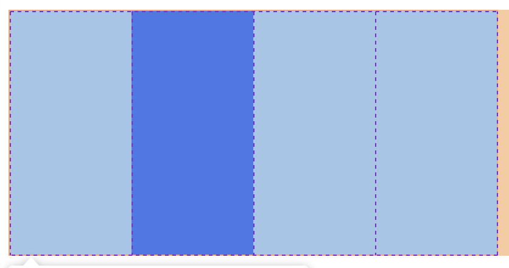
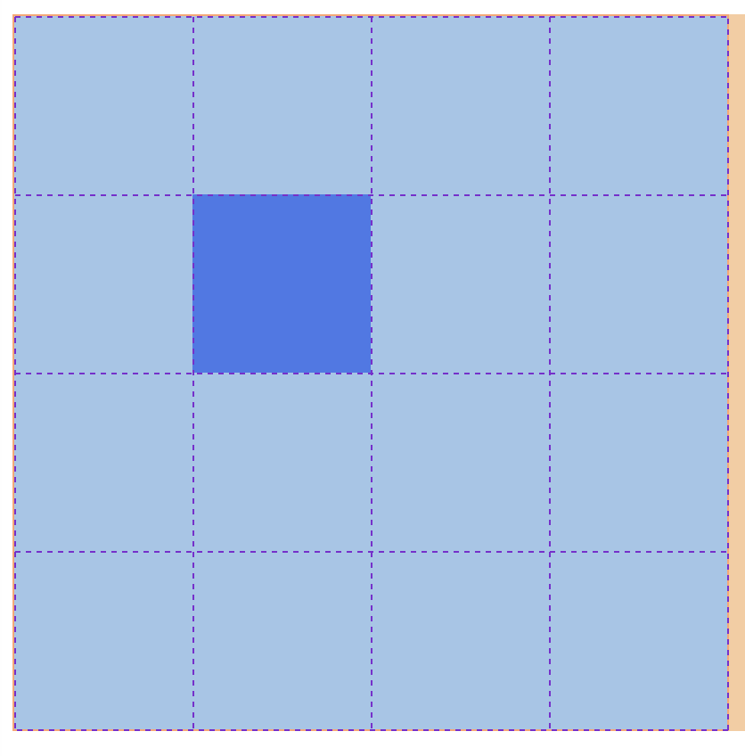

# CSS Grid


So far, Flexbox has been a very useful tool for making flexible, responsive layouts. But, it only really lets us make layouts in one direction: horizontal (Row) Or vertical (Column). We can combine multiple flex elements with nested flex children, but this can get a little tricky to keep track of.

Enter CSS Grid!


CSS Grid is a __2 Dimensional Layout System__ which can let us create layouts made up of both rows and columns.


Below is an example of some typical grid properties:

```css
.gridParentElement {
  display: grid;
  grid-template-columns: 100px 100px 100px 100px;
  border: 1px solid red;
  height: 200px;
  width: 400px;
}

.gridChildElement {
  grid-column-start: 2;
  grid-column-end: 3;
  background: blue;
}
```


What's going on here then?

For the parent Element:

- We add the property `display: grid;`, this makes the element into a __grid__ element.
- we define how many columns (vertical sections) the grid will have. In this case, it has 4 columns, each is 100 pixels wide.

For the child Element:

- We add the property `grid-column-start: 2;`, this means the element will __start__ from the beginning of the second column.
- We add the property `grid-column-end: 3;`, this means the element will __end__ before the third column.


An element can span multile columns. this element:

```css
.gridChildElement {
  grid-column-start: 1;
  grid-column-end: 3;
}
```

would start at the beginning of the first column, and end at beginning of the third, spanning 2 columns in total (2 columns wide).

The really useful thing about grid is that it can be 2 dimensional, for example:

```css
.gridParentElement {
  display: grid;
  grid-template-columns: 100px 100px 100px 100px;
  grid-template-rows: 100px 100px 100px 100px;
  border: 1px solid red;
  height: 200px;
  width: 400px;
}

.gridChildElement {
  grid-column-start: 2;
  grid-column-end: 3;
  grid-row-start: 2;
  grid-row-end: 3;
  background: blue;
}
```



Now we have a 2 dimensional grid with rows and columns, and can position elements easily inside it.

### Different unit types

We don't just have to use pixels to size our grids. There are lots of different units, but the one i would like to mention today is `fr`, which is a __fractional unit__.

- `grid-template-columns: 1fr 1fr 1fr 1fr;` would create a grid with 4 equal-sized columns, aka quarters.
- `grid-template-columns: 1fr 2fr 1fr;` would create a grid with 3 columns, the first one being a quarter of the total size, second one being half the total size, and finally the third column being a quarter of the total size again.

For grids with lots of equal sized columns, we can save a bit of time by writing this:

```css
.gridParentElement {
  display: grid;
  grid-template-columns: repeat(12, 1fr);
}
```
This will create 12, equally sized columns, very handy!

## [Let's practice with grid garden!](https://cssgridgarden.com/)


### Other grid properties
 - `column-gap` This lets us add space between each column (called 'gutters'), very handy!
 - `row-gap` Same, but for rows.

There are lots of other grid properties, but I'd suggest getting comfortable with what we know so far, before checking them out.

### Quiz

- Why do people recommend using 12 columns?
- Why do you think this doesn't apply to the number of rows?

## Learn more

-   [CSS Tricks: A complete guide to Grid](https://css-tricks.com/snippets/css/complete-guide-grid/)
-   [W3 Schools: CSS Grid Layout ](https://www.w3schools.com/css/css_grid.asp)
