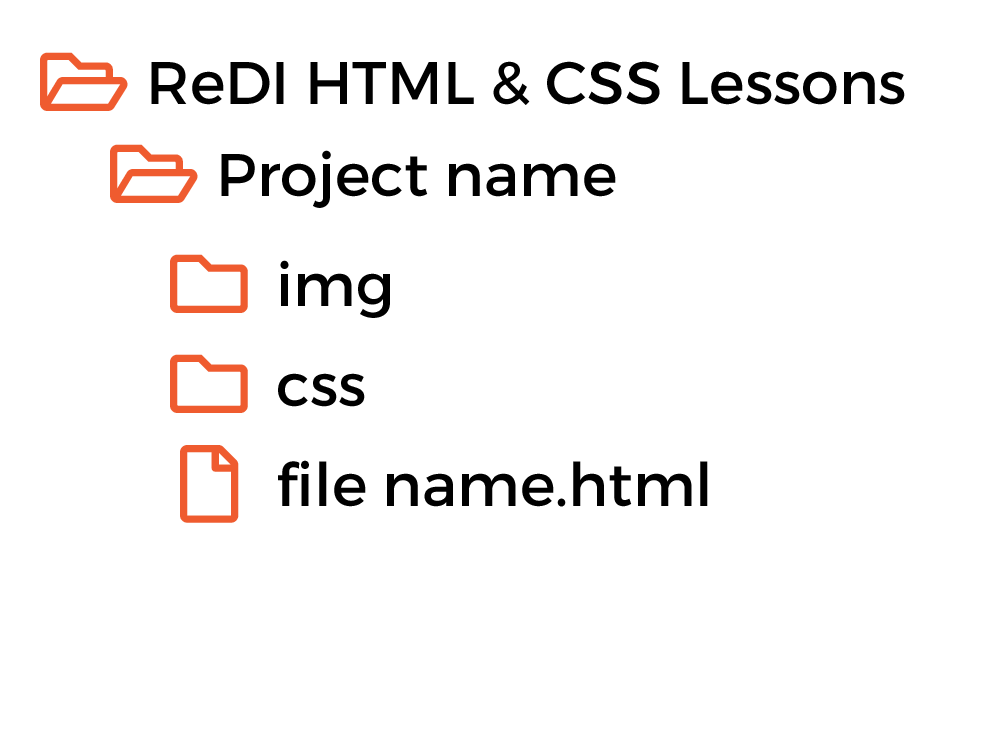
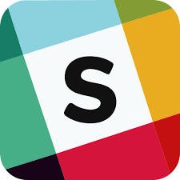

# What We Need

## Atom

Atom is a free and open-source text and source code editor for macOS, Linux, and Microsoft Windows with support for
plug-ins, developed by GitHub. There are many other free editors but to keep things simple, let's all work with this
one. It should be already on your laptops. You can learn more and also download it from https://atom.io.

## Browser

There are many browsers in the market: Chrome, Firefox, Safari, Opera, Internet Explorer, Edge and a few other ones. We
will use Google Chrome, which is the most popular at the moment and a solid product. If you don't have it installed, you
can download it from www.google.com/chrome.

## A good folder structure

We will follow conventions to make it is easier for each of us to see and understand the different projects. We will
create a folder called ReDI HTML&CSS Lessons and inside that folder we will make one new folder per project. Each
project folder will have two extra folders; one for all the images, called img and one for the css files. At root level
(that is, inside the project folder) we will have the different HTML files.

## Slack

There are many communication tools, but we officially chose Slack. There we have a channel for the class where we can
share materials, examples, links, updates about the classes etc. Everyone is on that channel so let's check if we have
it installed and is working. If it's not on your computer, you can download it from slack.com.

