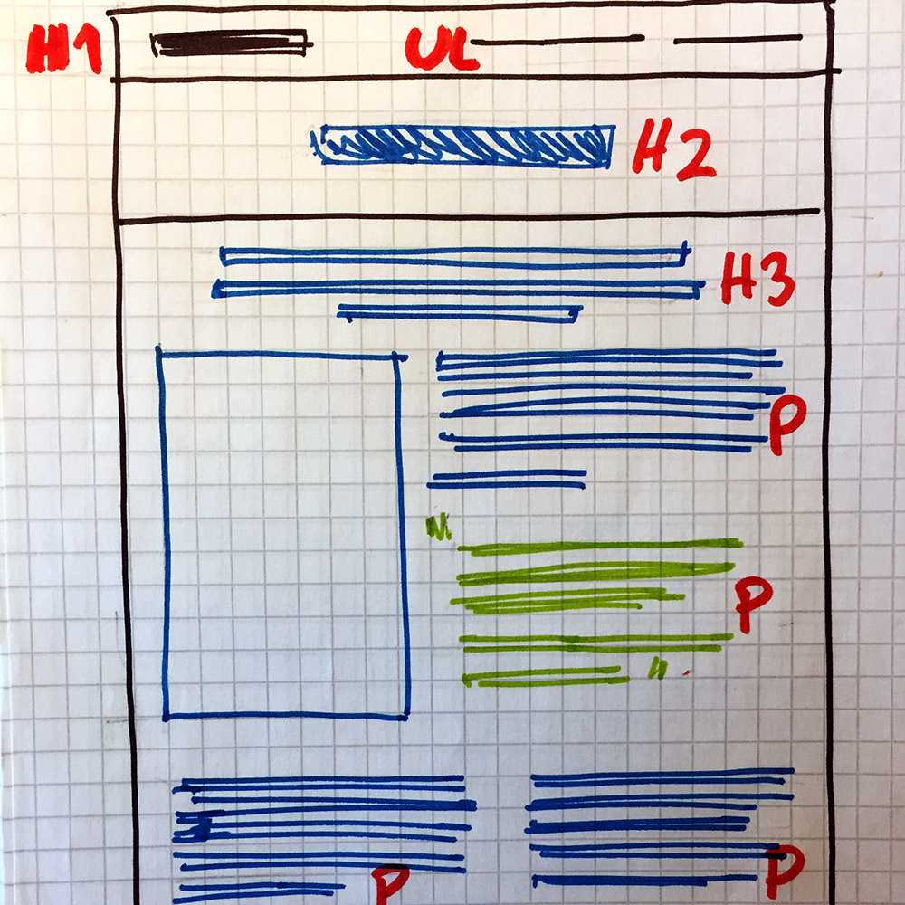

# HTML Basics  - An Exercise

## What we have learned so far

All HTML tags (at least until now) have a semantic meaning: headings should be written with `h1` (bigger) to `h6`
(smaller); sentences and paragraphs should be done with `p` and lists (including a navigation, which is a list of links)
should be done with `ul` or `ol`, depending on the case.

- Headings: `h1` to `h6`
- Paragraphs with `p`
- Lists with `ol` (ordered list) or `ul` (unordered list). Each item on the list is wrapped with `li`

## Exercise

Let's do a quick page with the elements we know. The page should include:

- At least three headings: one `h1` (there should be only one per page) and as many `h2` to `h6` as you need
- At least one paragraph: `p`
- At least two lists; one `ol` (ordered list) and one `ul` (unordered list)

Here's an example of a [Museums page](./museums.html).

## Ideas

- A quick recipe page: (name of the dish, description, ingredients, steps to prepare it)
- A city/place/sport that you like
- A short intro of who you are
- Any other better idea than these ones!

## Back to the paper prototypes

Now that we practiced a bit with HTML, let's recognize and mark on our paper websites the HTML elements that we just
used. Like this:

