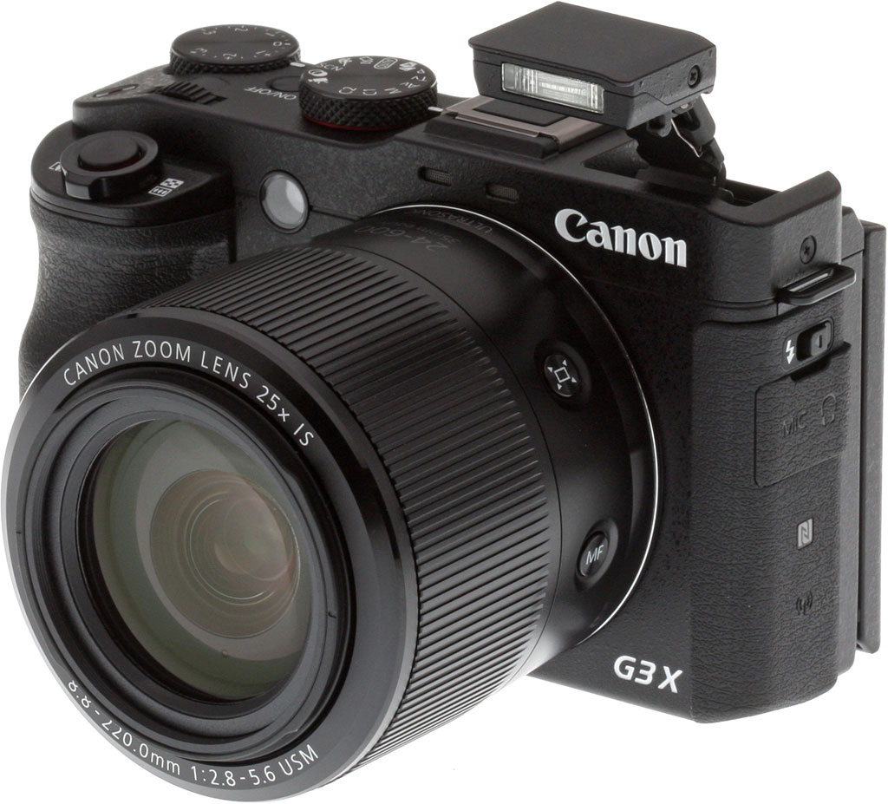
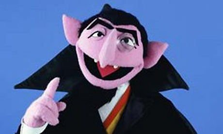

# More HTML Basics

## HTML Comments

When we code is very useful (and important) to write notes for ourselves or for colleagues who might use the code later.
A description of what a certain part of the website is for, a reference, a code hidden for the future etc; all of this
can be done with HTML Comments.

The comments start with `<!--` and end with `-->`. Anything on an HTML document between these two tags won't appear on
the browser.

```
<!-- Main navigation -->
<ul>
    <li>About</li><!-- Harrold, please add the links later -->
    <li>Work</li>
    <li>Contact</li>
    <!--  <li>Facebook</li> let's hide this for now -->
</ul>
```

**This will be the result:**

<ul>
  <li>About</li>
  <li>Work</li>
  <li>Contact</li>
</ul>

## HTML Links // Click me!


## Links // Hypertext (the "h" in http)

Hypertext documents at the beginning of the 90s (just before the WWW)

- Jumping around in the document through clicks (cf. novel reading)
- e.g. a pdf document: The [user manual](./manual.pdf) of a photo-camera




## Links // \*\*\*THE\*\*\* Brilliant Idea

Links _between_ documents that can be __anywhere__ in the world


## Links // Internet Surfing


<video style="width: 100%;" class="center" id="video_D30_10_008_html5_api" autoplay="" loop="" preload="auto" poster="//cdn8.dissolve.com/p/D30_10_008/D30_10_008_0004_600.jpg" muted="">
  <source src="https://cdn6.dissolve.com/p/D30_10_008/D30_10_008_detail.mp4" type="video/mp4">
</video>

## Links // How To

### Hyperlinks

The power of the web is that pages can lead to other pages. When you click on a link on a web page, it takes you to
another page. This link is called a **hyperlink**.

Hyperlinks are created with [anchor elements](https://developer.mozilla.org/en-US/docs/Web/HTML/Element/a), which
generally look like:

```
<a href="https://www.google.com/">Google</a>
```

and render on the page like this: [Google](https://www.google.com/).

Inside the opening `a` tag there is `href`, which stands for "reference." This is called an **attribute**. Attributes
like `href` describe the properties of HTML elements. In this case, the `href` attribute is the target URL that the link
will open. The content inside the anchor element is the text that users see displayed on the page.

This is the format that you must use when you make hyperlinks! Note:

- There is a space between `a` and `href`
- There are no spaces around the `=`
- The website has two `"` around it
- There are no spaces between the `href` attribute and the `>` of the opening tag.

## Links // Two small exercises

Type in a link that points to [https://www.redi-school.org/](https://www.redi-school.org/) and displays as "Redi-School".

Make an Internet shopping guide (just a list), with 5 items like: "If you need shoes, buy them at
[Zalando](https://www.zalando.com/). For books, go to .... etc".

BTW: The attribute `target="_blank"` will open a link in a new tab!

```
<a href="https://www.google.de" target="_blank">Google</a>
```

## Links // Image As A Link - Exercise

So far we have made text links.

How can we make an image into a link?

Remember, what was inside the anchor tag `<a>` when making a text link?

## Links // Image as Link - Solution

[This is a text link](https://www.google.com/)

```
<a href="https://www.google.com">This is a text link</a>
```

This is an image as a link: [](https://www.google.com/)

```
<a href="https://www.google.com"></a>
```

**Learn more**:

- [W3Schools: HTML Images](https://www.w3schools.com/html/html_images.asp)
- [W3Schools: HTML Links](https://www.w3schools.com/html/html_links.asp)
- [W3Schools: HTML Attributes](https://www.w3schools.com/html/html_attributes.asp)
